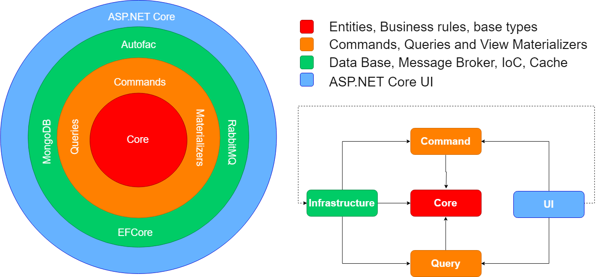
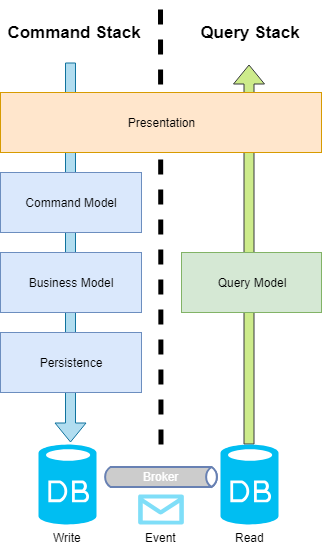
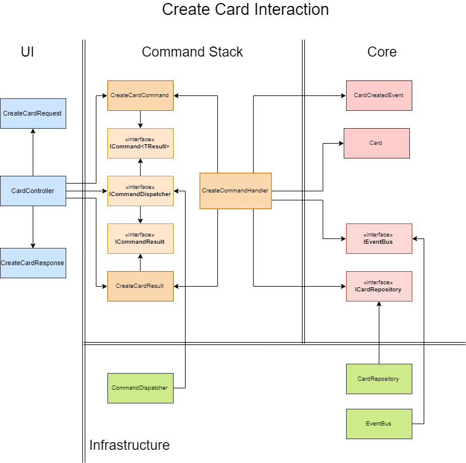
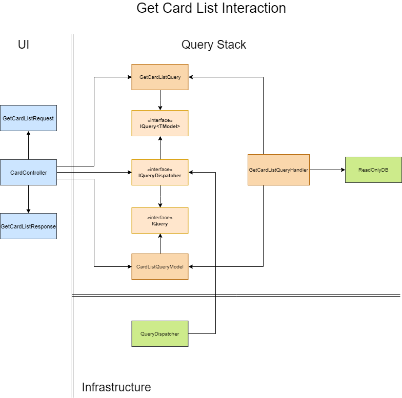

#  Clean Architecture CQRS with Derived Data  

CQRS, using Clean Architecture, multiple databases and Eventual Consistency

## :bookmark_tabs: Detailed information

I also keep more detailed information in my blog, and I going to release weekly to clarify my ideas:

- [X] <a her="https://blog.fals.io/2018-09-19-cqrs-clean-architecture/" target="_blank">CQRS Translated to Clean Architecture</a>
    - [ ] CQRS Deep dive into Commands
    - [ ] CQRS Queries and Materialization
    - [ ] CQRS Consensus and Consistency
    - [ ] CQRS Distributed chaos, CAP Theorem

## :floppy_disk: How do I use it?

You need some the fallowing tools:

* Docker
* Visual Studio 2017
* .Net Core 2.1

## :dart: Clean Architecture

Here's the basic architecture of this microservice template:

* Respecting policy rules, with dependencies always pointing inward
* Separation of technology details from the rest of the system
* SOLID
* Single responsibility of each layer

## :scissors: CQRS

Segregation between Commands and Queries, with isolated databases and different models

### :arrow_down: Command Stack

Has direct access to business rules and is responsible for only writes in the application.

Below you can find a basic interaction between components in the **Command Stack**:

### :arrow_up: Query Stack

Responsible to provide data to consumers of your application, containing a simplified and more suitable model for reading, with calculated data, aggregated values and materialized structures.

The fallowing image contains the basic interaction between components in the **Query Stack**:

## :books: DDD

This example contains a simplified Domain Model, with entities, aggregate roots, value objects and events, which are essential to synchronize the writing with reading database.

## :heavy_check_mark: TDD

The project contains a well-defined IoC structure that allow you unit test almost every part of this service template, besides technology dependencies.

Inside the main layers you going to find Interfaces which are essential for the application, but with their implementations inside their own layers, what allow Mocking, Stubbing, using test doubles.

## :bar_chart: Data Intensive Microservice

This microservice template comes with SRP and SOC in mind. Given the own nature of CQRS, you can easily scale this application tuning each stack separately.

## :page_facing_up: Derived Data

Having multiple data stores makes this system a Derived Data system, which means, you never lose data, you can always rebuild one store from another, for example, if you lose an event which sync data between the write and read database you can always get this data back from the write database and rebuild the read store.

## :envelope: Message Broker

Given the physical isolation of data stores, **Command Stack** and **Query Stack** must communicate to synchronize data. This is done here using a Message Broker.

Every successful handled command creates an event, which is published into a Message Broker. A synchronization background process subscribes to those events and is responsible for updating the reading database.

## :clock2: Eventual Consistency

Everything comes with some kind of down side. The case of CRQS with multiple databases, to maintain high availability and scalability we create inconsistencies between databases.

More specifically, replicating data between two databases creates an eventual consistency, which in a specific moment in time, given the replication lag they are different, although is a temporary state and it eventually resolves itself.

## :clipboard: References

Here's a list of reliable information used to bring this project to life.

* <a href="https://www.amazon.com/Designing-Data-Intensive-Applications-Reliable-Maintainable/dp/1449373321/ref=sr_1_1?ie=UTF8&qid=1537824366&sr=8-1&keywords=designing+data-intensive+applications" target="_blank">Designing Data Intensive Applications</a>

* <a href="https://www.amazon.com/Clean-Architecture-Craftsmans-Software-Structure/dp/0134494164" target="_blank">Clean Architecture, Robert C. Martin</a>

* <a href="https://azure.microsoft.com/en-us/campaigns/cloud-application-architecture-guide/" target="_blank">Cloud Application Architecture Guide</a>

* <a href="https://www.microsoftpressstore.com/store/microsoft-.net-architecting-applications-for-the-enterprise-9780735685352" target="_blank">Microsoft .NET - Architecting Applications for the Enterprise, 2nd Edition</a>
